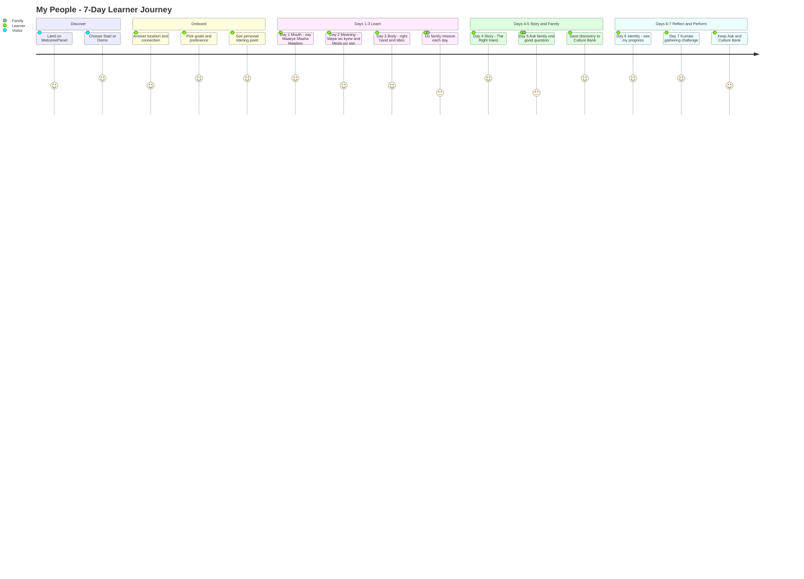
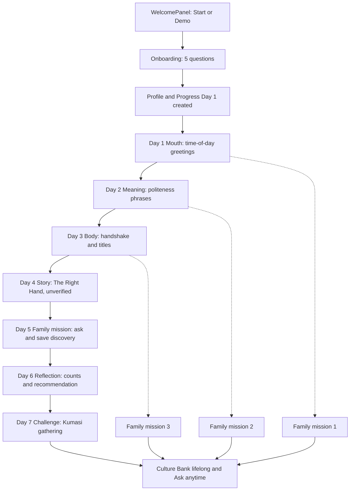
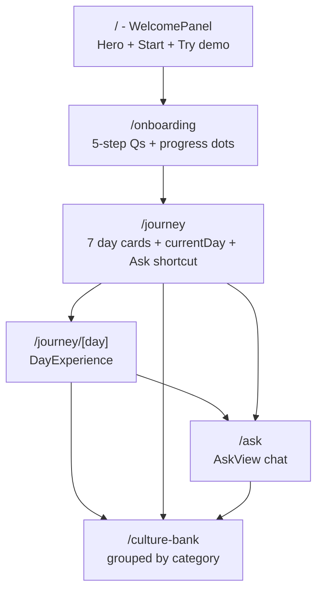
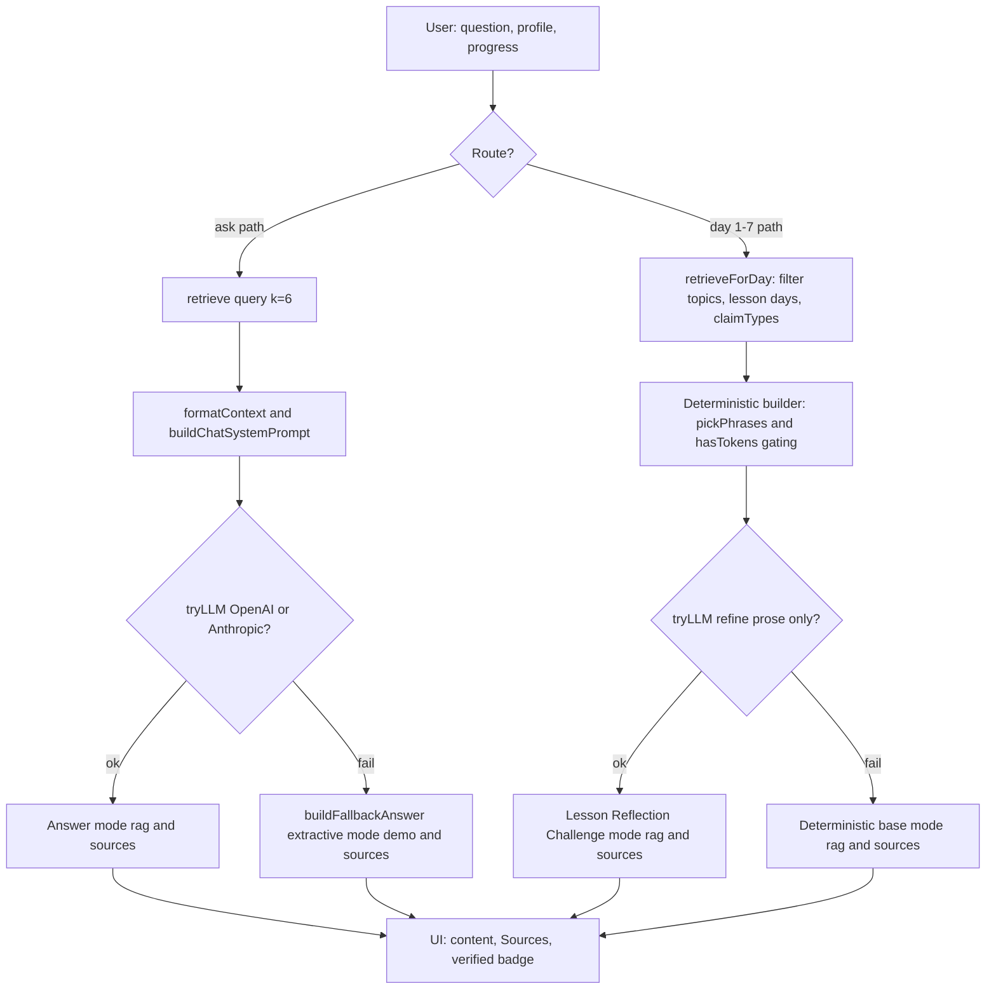
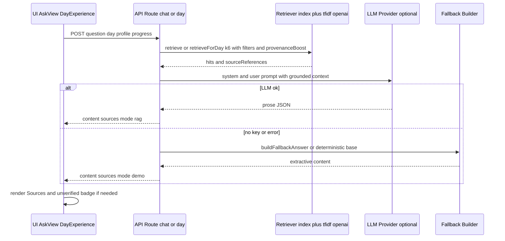
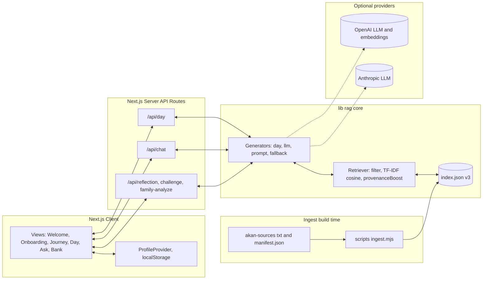

# My People — Project Report
### An AI Cultural Companion for Reconnecting with Asante Heritage (7-Day Journey)

| Field | Detail |
|---|---|
| **Project** | My People (`my-people-app`, v0.1.0) |
| **Stack** | Next.js 16.3.4 (App Router), React 19, Tailwind CSS v4, shadcn/radix, TypeScript |
| **AI / Retrieval** | Curated RAG (TF-IDF fallback + optional OpenAI embeddings + OpenAI/Anthropic LLM + deterministic demo fallback) |
| **Scope (MVP)** | Ghana · Akan · Twi · 7 days · localStorage-only |
| **Routes** | `/`, `/onboarding`, `/journey`, `/journey/[day]`, `/ask`, `/culture-bank` |
| **APIs** | `/api/day`, `/api/lesson`, `/api/reflection`, `/api/challenge`, `/api/chat`, `/api/family-analyze` |
| **Author** | [Your Name] — Codetrain Demo |
| **Date** | [DD MMM YYYY] |

> How to use this document: Sections 1–5 are the five requested artifacts. All diagrams are provided as **Mermaid code** for **https://mermaid.live** (free, no login: paste → Render → Export PNG/SVG for your PDF submission). See Appendix A for step-by-step rendering instructions.

---

## Table of Contents

1. [1. PRD — Product Requirements Document](#1-prd--product-requirements-document)
2. [2. User Journey](#2-user-journey)
3. [3. Wireframe (Low-Fidelity)](#3-wireframe-low-fidelity)
4. [4. AI Workflow](#4-ai-workflow)
5. [5. Architecture Diagram](#5-architecture-diagram)
6. [Appendix A — How to Render the Diagrams](#appendix-a--how-to-render-the-diagrams-mermaidlive)
7. [Appendix B — Demo Run Instructions](#appendix-b--demo-run-instructions)

---

## 1. PRD — Product Requirements Document

### 1.1 Problem Statement

Many young people of Asante heritage — especially those living abroad (UK, US, Canada, Europe) — feel disconnected from their culture. They do not know where to start, fear making etiquette mistakes (greetings, titles, handshake, elder respect), and cannot easily ask family the right questions. Generic AI chatbots invent Twi phrases and traditions, which destroys trust.

**My People** solves this with a grounded, 7-day guided journey + an ask-anything companion that *only* answers from a curated knowledge base, with visible sources and honesty when sources are silent.

### 1.2 Goals (MVP Demo)

1. Take a learner from “I barely know anything” to “I can greet, show respect, and ask my family one good question” in ~45 minutes total (5–8 min/day).
2. Never fabricate culture: every lesson and chat answer carries provenance (`title`, `authority`, `specificity`, `verified` flag).
3. Demo never breaks: works with **zero API keys** via deterministic fallback; improves with keys when present.
4. Make family part of the product (Day 5 mission + Family Discoveries + Culture Bank).

### 1.3 Non-Goals (Out of Scope for MVP)

- No auth, no database, no multi-user sync (localStorage-only by design).
- No full Asante history, no audio/pronunciation trainer, no multilingual UI.
- No open-web browsing; corpus is deliberately limited to 2 owner-provided files (demo constraint, not a claim about Asante culture).
- No swapping the 7-day scaffold — personalization happens *inside* each day.

### 1.4 Target Users & Personas

| Persona | Context | Needs |
|---|---|---|
| **Ama (UK, 19, “somewhat connected”)** — primary demo profile | Lives in UK, knows fragments, nervous at family gatherings | Time-of-day greetings, titles (Owura/Awuraa/Maame/Nana), right-hand rule, confidence script for Day 7 Kumasi gathering |
| **Kwame (Ghana, 24, “very connected”)** | Immersed daily | Deeper politeness (`Mepa wo kyɛw`, `Meda wo ase`), story behind behaviour |
| **Elder / Family member** (indirect user) | Receives Day 5 question | A respectful, specific question — not an interrogation |

Demo seed (`lib/constants.ts`): `Asante · United Kingdom · Asante Twi · goals: greetings-etiquette, language, family-heritage`.

### 1.5 Functional Requirements

| ID | Feature | Description (as built) | Acceptance |
|---|---|---|---|
| FR1 | Onboarding (5 Qs) | Location (6) → Cultural connection (5) → Learning goals multi-select (8) → Family knowledge (5) → Learning preference (6). Creates `UserProfile` + fresh `LearningProgress(currentDay=1)`. | Profile + progress in localStorage; validation blocks empty goals |
| FR2 | Days 1–4 Lessons | `DayLesson`: hook, concept block + phrases, practice items, scenario quiz (3 Qs), cultural insight, family mission, flex line, sources. Day 1 personalised by time-of-day (`morning/afternoon/evening/night`). `hasTokens` gating: phrase appears only if tokens exist in retrieved corpus. | Lesson renders even with no keys; missing source quietly shrinks lesson, never invents |
| FR3 | Day 5 Family Mission | No new lesson. One personalised question from profile (`history` > `family-heritage/family` > `speaking` > `events` > low-knowledge fallback). Includes “hesitant relative” coaching scenario. Answer saved as `FamilyDiscovery` + auto `CultureBankItem`. | Discovery persists; appears in Day 6 counts |
| FR4 | Day 6 Reflection | Aggregates `practicedConcepts`, `learnedConcepts`, `cultureBank`, `familyDiscoveries`; weakest-confidence recommendation; last-3 bank picks. LLM refines prose only. | Correct counts; recommendation references weakest concept if present |
| FR5 | Day 7 Challenge | Kumasi gathering scene, 6 scenario steps (greetings/titles/handshake/politeness), sorted weakest-first via `confidenceScores`. Closing chapter line. | Scoring exact (deterministic steps); order adapts to quiz history |
| FR6 | Ask (free chat) | Input + suggested questions (4 defaults) + grounded answer + Sources list + `rag/demo` mode badge + follow-ups. | Uncovered question → honest “not in my sources” + redirect to greetings/politeness |
| FR7 | Culture Bank | Categories: `word, saying, people, story, family-discovery, insight`. Grouped view, sourced from lesson/family/challenge/reflection. | Items persist across reloads |
| FR8 | Progress & Confidence | `currentDay` (1–7 capped), `completedDays`, `quizResults`, `confidenceScores` (+0.2/−0.25 quiz, +0.15/−0.2 practice). `completeDay` advances; reset clears both keys. | Refresh keeps day; Day 7 stays playable after completion |
| FR9 | Provenance & Safety | Every response returns `SourceReference[]`. Unverified content flagged inline + “Unverified account” badge (Day 4 story always `verified:false`). System prompt rules: Accuracy > Relevance > Simplicity > Memorability; never present one Akan subgroup as universal; only use Twi terms from sources. | No answer without sources section; Day 4 banner always visible |

### 1.6 Data & AI Requirements

- **Corpus:** `akan-sources/Introductory-Lesson-on-Greetings-in-Asante-Twi.txt` + `Being polite in Asante Twi.txt` + `manifest.json` (~2.5KB, ~130 terms). Both tagged **provisional/unverified** until owner re-tags.
- **Ingest:** `npm run ingest` → normalize glyphs (⊃/ↄ→ɔ, Ɛ/Ɔ→ɛ/ɔ, NBSP→space) → chunk whole files → stamp manifest metadata → TF-IDF vectors + optional OpenAI embeddings → `lib/rag/index.json (v3)`. Missing index triggers background re-ingest, never a 500.
- **Retrieval:** `retrieveForDay(day, spec, k=6)` filters by `topics/lesson_days/claimTypes/contentTypes` first, then cosine + `provenanceBoost (authority + Asante-specificity)`.
- **Generation:** deterministic structure (phrases/scenarios/steps) + LLM refines *prose only* (`refineLessonProse`, `refineDay4Story`, `refineReflection`, `refineChallenge`). No keys → `buildFallbackAnswer` (extractive sentences, goal-aware intro, honest closing).

### 1.7 Non-Functional Requirements

- Performance: lesson/chat p95 < 4s with LLM, < 500ms in demo fallback.
- Reliability: empty-index tolerant; `AbortSignal.timeout(15000)` on embedding calls.
- Privacy: no server persistence; profile sent in request body, endpoints stateless.
- Accessibility: shadcn/radix primitives, keyboard-navigable quiz, readable Twi diacritics (ɔ, ɛ).

### 1.8 Future Work (Post-MVP)

Verified sources + page numbers, audio pronunciation, Twi spell-check, family tree / story upload, spaced repetition from `confidenceScores`, teacher dashboard.

---

## 2. User Journey

### 2.1 Narrative (concise)

1. **Discover:** Lands on `WelcomePanel` → “Start” or “Try demo”.
2. **Onboard (2 min):** Answers 5 questions → sees personal starting point (`Asante · UK · Asante Twi`).
3. **Days 1–3 (Mouth → Meaning → Body):** Learns time-of-day greetings (`Maakye/Maaha/Maadwo` + `Yaa agya/ena/nua`), politeness (`Wo ho te sɛn?`, `Mepa wo kyɛw`, `Meda wo ase`), body rules (right hand only, left-to-right, titles `Owura/Awuraa/Maame/Nana/ɔpanyin`). Each day ends with a **family mission** (“What greeting did you use growing up?”).
4. **Day 4 (Story):** Reads “The Right Hand” (flagged unverified) — understands *why* respect has a shape.
5. **Day 5 (Family):** Asks one personalised question, saves verbatim answer to Culture Bank.
6. **Day 6 (Identity):** Sees counts, insight, weakest-area recommendation.
7. **Day 7 (Performance):** Passes Kumasi gathering simulation → earns closing chapter (“You can walk into that gathering now”).
8. **Ongoing:** Uses **Ask** for doubts, grows **Culture Bank** as lifelong asset.

### 2.2 Diagram — Copy to https://mermaid.live



> Alternative flowchart version (use if `journey` diagram type is disabled in your export target):



**Website:** https://mermaid.live — select diagram type auto-detect, paste code, Export → PNG/SVG.

---

## 3. Wireframe (Low-Fidelity)

### 3.1 Sitemap — Copy to https://mermaid.live



### 3.2 Low-Fi Screens (ASCII — recreate in Excalidraw if needed)

**Website option for hand-drawn look:** https://excalidraw.com (free, no login → copy boxes below as rectangles + text).

```
(A) WELCOME (/)                      (B) ONBOARDING (/onboarding)
+----------------------------+      +----------------------------+
|  My People                 |      |  Q2/5: How connected...    |
|  Reconnect with Asante     |      |  (o) Very connected        |
|  [Start journey] [Demo]    |      |  ( ) Somewhat  ( ) Some    |
|  Asante - UK - Asante Twi  |      |  [Back] [Continue] ooooo   |
+----------------------------+      +----------------------------+

(C) DAY LESSON (/journey/1)          (D) ASK (/ask)
+----------------------------+      +----------------------------+
| Day 1 - Say It Like... 6m  |      |  Ask anything              |
| Hook: Walk away able...    |      |  [Why do greetings matter?]|
| Concept + Phrases chips    |      |  User: How do I greet...?  |
| Practice [input][check]    |      |  AI: ... + [rag/demo]      |
| Scenario Q (4 choices)     |      |  Sources: (1) title ...    |
| Family mission card        |      |  [input ..........][Send] |
| Sources + [Complete day]   |      |                            |
+----------------------------+      +----------------------------+

(E) CULTURE BANK (/culture-bank)
+----------------------------+
| Words | Sayings | People   |
| [Maakye - Good morning]    |
| Family discoveries (quote) |
| Stories (unverified badge) |
+----------------------------+
```

Key wireframe notes for assessor: `PageShell` wraps all inner routes (consistent header/nav); `DayExperience` swaps `DayLesson / Day6Reflection / Day7Challenge` by day number; Sources block appears on *every* AI surface; `verified:false` renders amber “Unverified account” badge.

---

## 4. AI Workflow

### 4.1 How It Works (concise)

**Two pipelines share one retriever:**

1. **Ask (free chat)** — `askGuide(question, profile)` in `lib/rag/llm.ts`:
   Retrieve (k=6, no day filter) → `formatContext` + `buildChatSystemPrompt(profile)` → `tryLLM` → success = `mode:rag`, fail = `buildFallbackAnswer` extractive demo (`mode:demo`). Always returns `sources`.
2. **Lesson (Days 1–7)** — `generateDay(day, profile, progress)` in `lib/rag/day.ts`:
   `retrieveForDay(day, JOURNEY_DAYS[day].retrieval)` → deterministic builders (`buildDay1…buildDay7`, `hasTokens`/`pickPhrases` gating) → LLM refines **prose only** (`refineLessonProse`, `refineDay4Story` with `verified:false` lock) → fallback = deterministic base (still grounded). Day 6/7 aggregate `progress` (counts, `confidenceScores`, weakest-first sorting).

Safety invariants: structure never comes from the LLM (so quiz scoring stays exact); Twi terms pass only if tokens exist in corpus; empty corpus → honest “not in my sources” instead of invention.

### 4.2 Diagram 1 — Flowchart — Copy to https://mermaid.live



### 4.3 Diagram 2 — Sequence — Copy to https://mermaid.live



**Website:** https://mermaid.live — paste either block, Render, Export.

---

## 5. Architecture Diagram

### 5.1 Description (concise)

- **Client:** Next.js App Router pages + `ProfileProvider` (localStorage `profile:v2`, `progress:v2`) + views (`WelcomePanel`, `OnboardingView`, `JourneyView`, `DayExperience`, `AskView`, `CultureBankView`) inside `PageShell`.
- **Server:** Stateless API routes (`/day`, `/lesson`, `/reflection`, `/challenge`, `/chat`, `/family-analyze`) receive profile+progress in body, call `generateDay`/`askGuide`, return content+sources+mode.
- **RAG core (`lib/rag/`):** `index.json (v3)` ← `scripts/ingest.mjs` ← `akan-sources/*.txt + manifest.json`; `index.ts` (filter+rank), `prompt.ts` (system/user builders), `llm.ts`/`day.ts` (pipelines), `llm-utils.ts` (`tryLLM`, `extractJson`), `fallback.ts`, `normalize.ts`, `tfidf.mjs`.
- **External (optional):** OpenAI (`gpt-4o-mini`, `text-embedding-3-small`) / Anthropic (`claude-3-5-sonnet`). Absent → demo mode. No DB, no auth.

### 5.2 Diagram — Copy to https://mermaid.live



**Website:** https://mermaid.live — paste, Render, Export PNG/SVG for report.

---

## Appendix A — How to Render the Diagrams (mermaid.live)

1. Go to **https://mermaid.live**.
2. Click **New Diagram** (or clear the editor).
3. Copy one `mermaid` block from Sections 2, 3.1, 4.2, 4.3, 5.2 and paste into the left code pane.
4. Diagram renders live on the right. Fix: keep `flowchart`, `sequenceDiagram`, `journey` keywords lowercase as shown.
5. **Actions → Export → PNG/SVG** and insert into your Word/PDF submission with caption (e.g. “Fig. 1 — User Journey (Mermaid, rendered via mermaid.live)”).
6. Alternative sites (same syntax): **https://www.mermaidchart.com**, **Notion / GitHub markdown** (paste block directly — both render Mermaid natively), **https://excalidraw.com** for hand-drawn wireframe styling.

## Appendix B — Demo Run Instructions

```bash
npm install
npm run ingest        # builds lib/rag/index.json from akan-sources/
npm run dev           # open http://localhost:3000
# Optional (better answers): copy .env.example -> .env.local, set OPENAI_API_KEY and/or ANTHROPIC_API_KEY
```

1. Click **Start** → answer 5 onboarding questions → land on `/journey`.
2. Play Day 1 (try morning vs evening for different lead greeting), complete → Day 2 unlocks.
3. Visit `/ask` → try “Why do greetings matter so much in Asante culture?” → check **Sources** + `rag/demo` badge.
4. Day 5 → save a family answer → check `/culture-bank` and Day 6 counts.
5. Day 7 Kumasi challenge → weakest concepts appear first (answer a quiz wrong to see reordering).

> Corpus honesty note (for assessor): MVP uses only 2 owner-provided files, both flagged provisional. A missing source shrinks a lesson instead of inventing content — this is intentional anti-hallucination design, not missing functionality.
